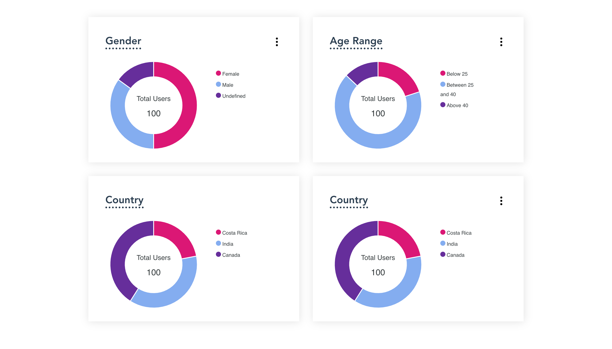

# chart

## Overview

This is a simple chart built with Vue.js.

## Features

- Donut chart that shows the legend, total number of users and the label
- When clicked on the menu button, the component gets duplicated
- On click, the menu button dissapears from the original component and appears on the duplicate (meaning that the component can be duplicated only once)

## Technologies

- HTML
- CSS
- JavaScript
- Vue.js
- Apexcharts

## Preview



## Project setup

```
npm install
```

### Compiles and hot-reloads for development

```
npm run serve
```

### Compiles and minifies for production

```
npm run build
```

### Lints and fixes files

```
npm run lint
```

### Customize configuration

See [Configuration Reference](https://cli.vuejs.org/config/).

<!-- ## Start the app

In the project directory, you can run:

### `npm install` -->
